# VietNamTravel mobile using Flutter & Firebase

## Project of Ho Chi Minh City University of Technology (Hutech)  

## Author : <a href="https://www.facebook.com/pnduong0606">Phạm Nam Duong</a>  

## Getting Started

Step 1:git clone https://github.com/NamDuongPham/Travel_VietNam.git  
Step 2:Open terminal enter command " flutter pub get "  
Step 3: Run with device android or ios  
Any questions contact: <a href="https://www.facebook.com/pnduong0606">Facebook</a>  

## Result

  

    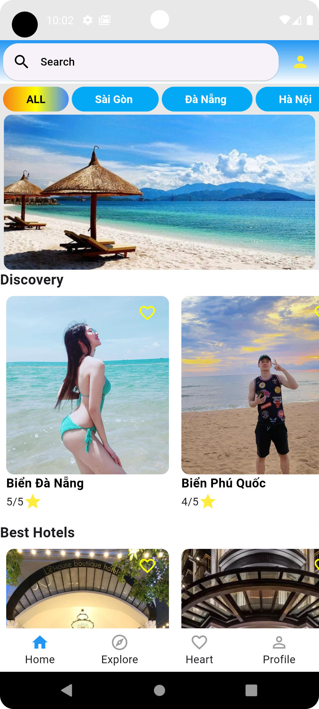
    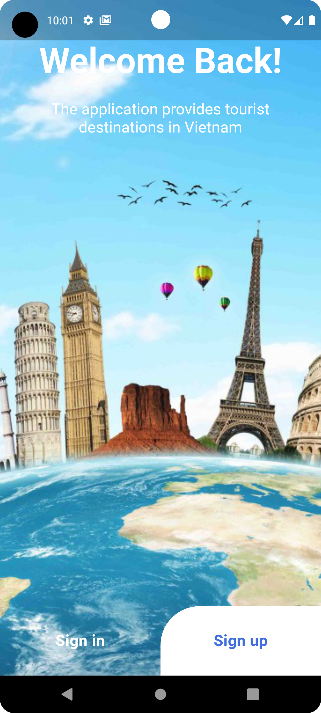
    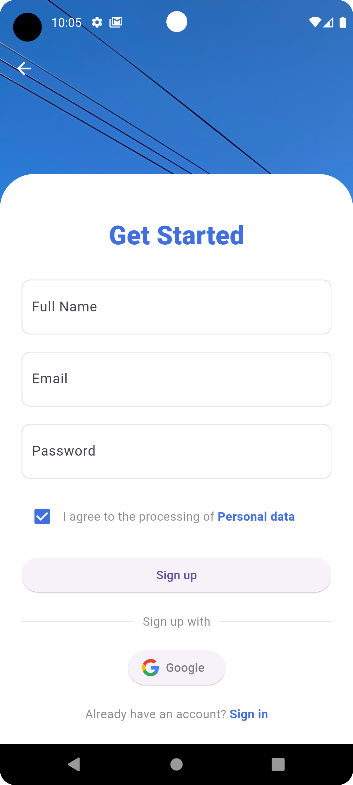
    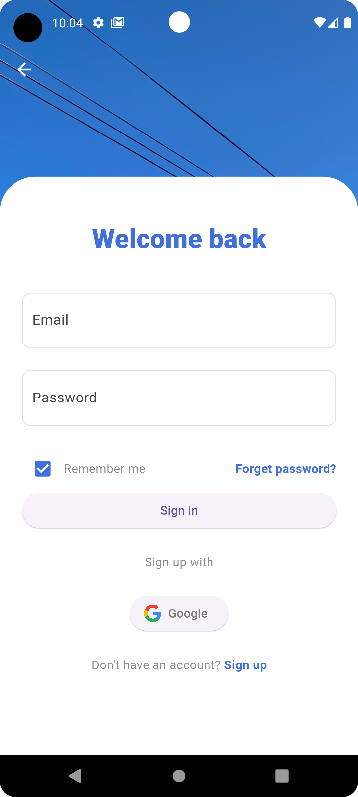
    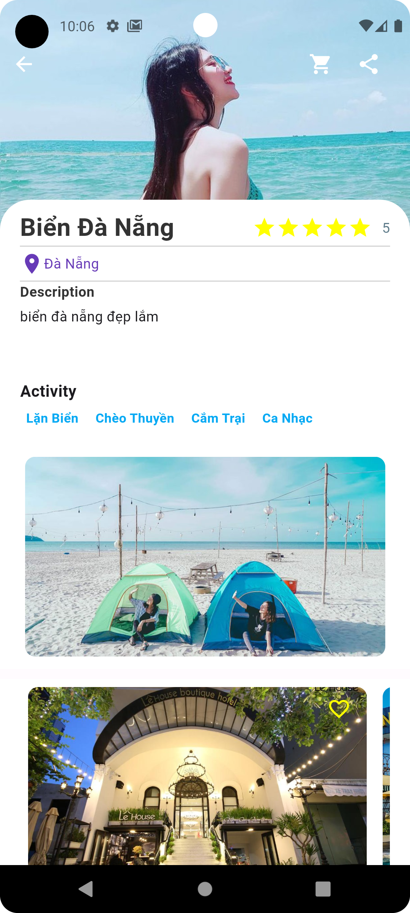
    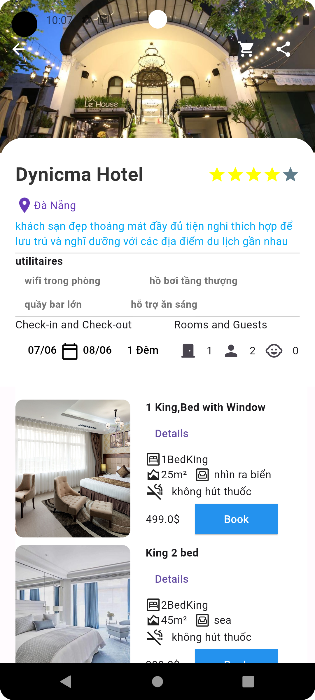
  

  

    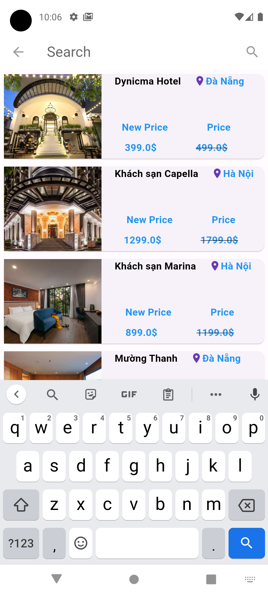
    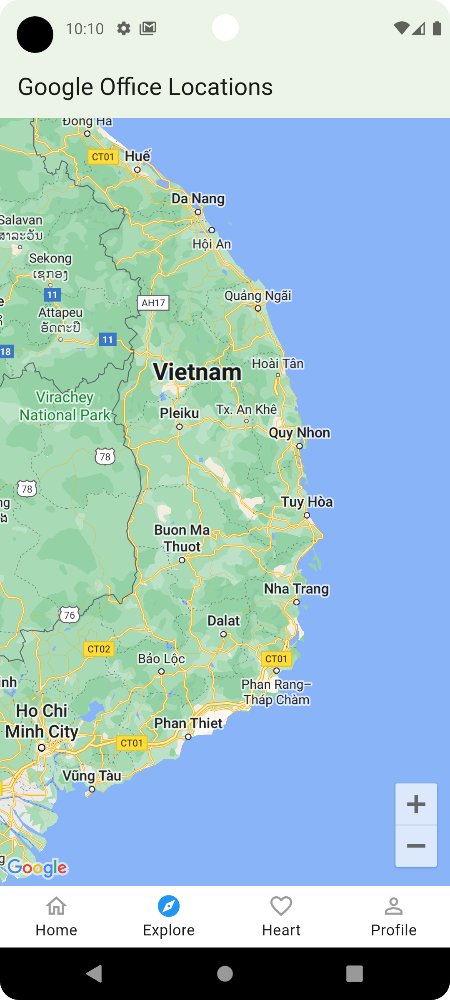
    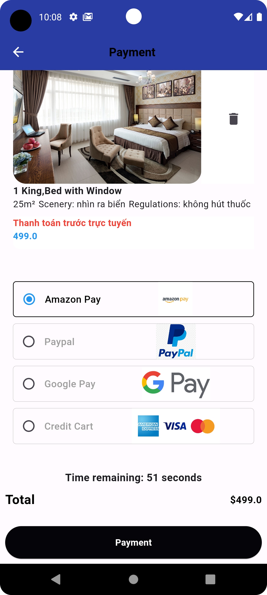
    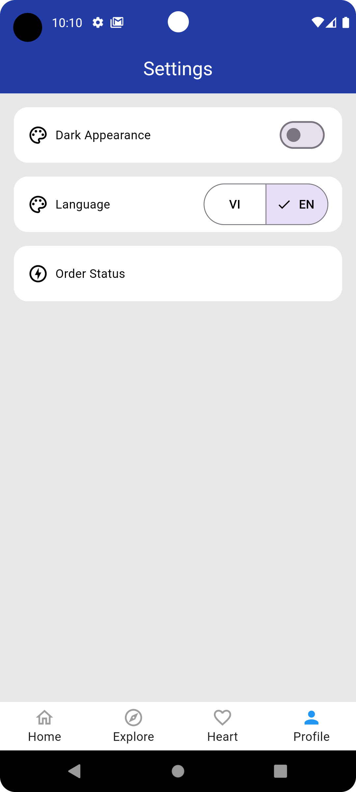
    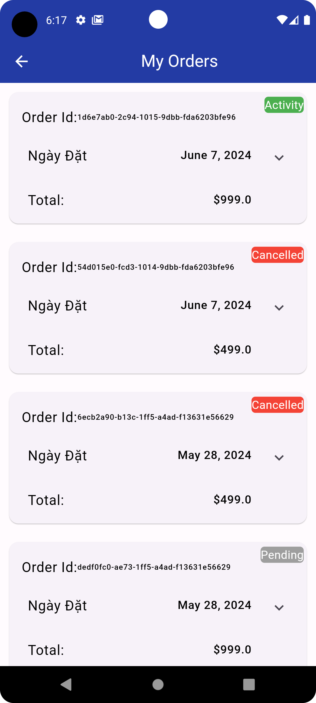
    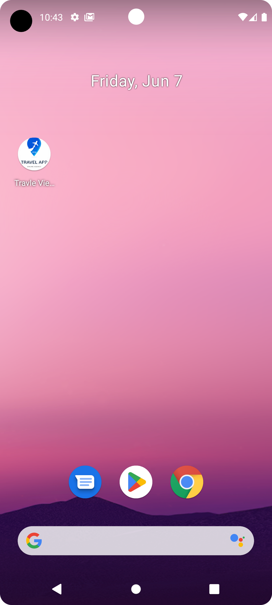
  

